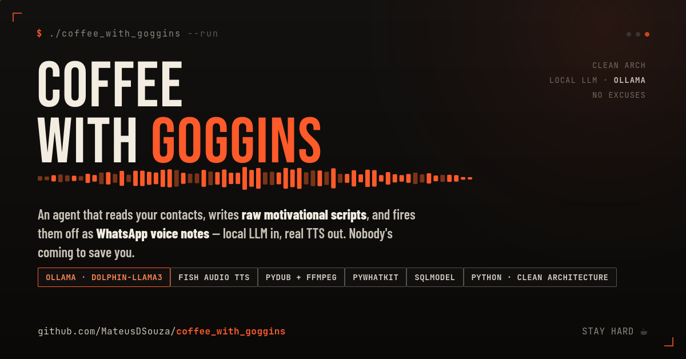

# Coffee with Goggins ☕🔥

An automated WhatsApp bot built with Python, local LLMs (Ollama), and TTS synthesis (Fish Audio) that generates personalized, high-intensity motivational voice messages for your contacts.

Inspired by David Goggins, the agent periodically reads from your contact list, generates customized, raw motivational scripts, converts them into high-quality audio voice notes with background audio processing, and dispatches them via WhatsApp Web automation.

---

## 🏗 Architecture & Tech Stack

This project follows **Clean Architecture** principles (Domain, Infrastructure, Application Services) with dependency injection to ensure full testability and maintainability.

* **LLM Core**: [Ollama](https://ollama.com/) running uncensored/custom models (e.g., `dolphin-llama3`).
* **Voice Synthesis (TTS)**: [Fish Audio API](https://fish.audio/) for expressive voice notes.
* **Audio Processing**: `pydub` (with `ffmpeg`) for background audio mixing.
* **Messaging & GUI Automation**: `pywhatkit`, `pyautogui`, `webbrowser`, and AppleScript / AppKit (`NSPasteboard` integration for macOS clipboard media file transfers).
* **Database & Storage**: `sqlmodel` / SQLite for logging sent message history.
* **Type Safety & Quality**: `mypy`, `pytest`, `pytest-cov`, and `black`/`flake8` linting tooling.

---
